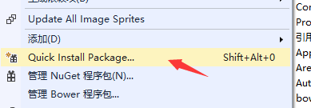
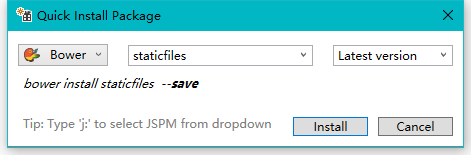

# 整体架构说明

## 前端技术

> 前端主要以jQuery-EasyUI-insdep 2.0为主，其他扩展js为辅，该 js 基于 easyui1.5.2 ，不兼容IE9及以下版本。 说明：类库基本上都在目录bower_components，由于项目中有些类库有所删除，故提供源文件下载地址，具体文档，官网都有提供。

* JQuery-EasyUI-insdep 2.0  [源文件下载地址](https://pan.baidu.com/s/1U8qu8DCP19aQY0hudkiXOA)、
[官网地址](https://www.insdep.com/) 项目文件有所增改，不可随意升级。
* jquery-extensions　[源文件下载地址](https://pan.baidu.com/s/1EDYwfHgGcQEA6S5N8-j_jg) 已无人维护，开源地址已经找不到了，该扩展基于easyui1.3.6，在本项目中不可直接引用发布后的压缩文件，必须拆分引用,按照依赖顺序引用该目录下的扩展:bower_components\jquery-extensions\jeasyui-extensions,部分bug已解决，有些扩展在新版本的easyui已经有了，所以在extensions中，有些可删除。
* jquery.jdirk.js 为js扩展了许多通用的方法,extensions-master依赖此js,完整的代码都在extensions-master中.[文档地址](http://223.2.193.104:11) 
* cropper 头像上传，裁剪，旋转等，blueimp-canvas-to-blob 解决部分浏览器兼容性
* 编辑器  轻量级 web 富文本编辑器，配置方便，使用简单。支持 IE10+ 浏览器 [wangeditor3](https://www.kancloud.cn/wangfupeng/wangeditor3/332599)
* 上传文件 [webuploader](http://fex.baidu.com/webuploader/)  兼容IE6+，Andorid 4+，IOS 6+,该js目录下的staticfile/libs/abp.wbeuploader.js，此js为自己扩展的js，不可随意升级，demo请参考：File/Index.cshtml（多文件上传），File/ImageView.cshtml（多图片上传、可预览）

## 前端维护
项目使用bower管理前端类库，staticfiles为该项目通用js
 * 维护地址为 hhttps://github.com/luoyunchong/staticfiles.git
 * bower 静态资源地址 http://223.2.193.13:5678/
 * staticfiles文件中Readme.md写了一些文档，用于介绍其功能的开发日志

>根目录新建.bowerrc文件，实现自定义bower仓库

~~~
{
    "registry": "http://223.2.193.13:5678",
    "timeout": 30000
}
~~~

> 在web项目目录执行以下命令

~~~
    bower install staticfiles --save
~~~
或安装扩展和更新（Package Installer)

右击WEB项目  

输入staticfiles 

最后点击install 即可安装从223.2.193.13安装staticfiles仓库的js，此文件夹中的相关介绍
* easyui.default-extension.js为easyui增加默认属性，扩展jquery方法
* base.js 大多数项目通用的com对象，
* passwordComplexityHelper.js 让密码也可以在后台配置
* libs 这个文件夹下的js是Abp自带的通用js，改了abp.jquery.js，增加了abp.easyui.js,abp.layer.js，统一的调用接口，可以实现不同的弹框效果
